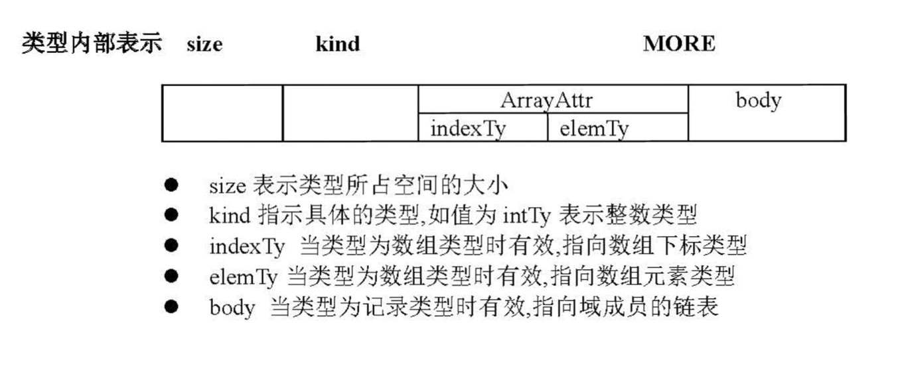

# SNL-Compiler
**2019级吉林大学计算机科学与技术专业《编译原理课程设计》——SNL语言编译器**

- 词法分析
- 递归下降语法分析
- LL1 语法分析
- 语义分析

## 词法分析

​	词法分析是编译程序的第一个模块，负责接收源程序，并根据语言的词法规则，从字符输入中提取单词，并生成对应的token序列内部表示，提供给其后的语法分析模块进行语法分析。

​	词法分析程序涉及的主要问题有：单词分类、Token定义，自动机的实现以及错误分析处理等。

​	单词分类参照课程教材分为：标识符（ID）、保留字（if，read等）、无符号整数（INTC）、单字符分界符（+、-等）、双字符分界符（：=）、注释头符与结束符（{、}），字符起始符与结束符（’）以及数组下标界限符（..）。据此在程序中定义**LexType**枚举类，其中元素与各单词一一对应。

​	Token结构的成分定义则是在教材定义的基础上扩展为**token**（Lineshow，Lex，Sem，pre，next）的五元组，分别表示单词在源程序中的行数、词法信息、语义信息，以及token链表的前继节点和后继节点的指针。

​	自动机的定义同样沿用教材中所提供的“识别SNL单词的DFA表示“。实现方法则采用了直接转向法，为此定义了枚举类型**state**，其中含有START等元素对应了自动机的每一个状态。每轮根据当前状态**state0**的生成。


​	词法分析的错误处理模块则分为错误检测和错误处理两个部分，其中错误处理部分采用了“恐慌模式”的错误回复策略，来控制错误的影响范围只限局部。错误检测部分在**DFA**中已经存在，在发现错误之后，错误处理模块报错，接下来根据“恐慌模式”的策略进行错误恢复，从剩余输入字符之中不断删除字符，直到词法分析器从剩余输入的开头发现一个可识别的正确字符为止。

## 语法分析


在实际编写程序时并未严格按照以上结构创建语法树，事实上可以随便创建，只要语义分析方便就行。

1. 递归下降语法分析（RD）能检测出来的错误：

   |                           语法错误                           | 对应非终结符函数 |
   | :----------------------------------------------------------: | :--------------: |
   |         变量类型不为基本类型（即不为CHAR与INTEGER）          |    baseType()    |
   |  域声明中变量类型不为基本类型（即不为CHAR、INTEGER与ARRAY）  |  fieldDecList()  |
   | 过程声明中的变量类型不为基本类型（即不为INTEGER、CHAR、RECORD、ARRAY、ID与VAR，其中VAR是变参，其余为值参） |     param()      |
   | 条件语句中表达式运算符不匹配（注：并不是操作数类型不匹配，那是语义分析干的事） | conditionalStm() |
   | 循环语句中的表达式运算符不匹配（注：并不是操作数类型不匹配，那是语义分析干的事） |    loopStm()     |
   |                  赋值语句与函数调用语句出错                  |    assCall()     |
   |                      加运算运算符不正确                      |     addOp()      |
   |                      乘运算运算符不正确                      |     multOp()     |
   |                    因子递归函数书写不正确                    |     factor()     |

   在遇到错误时，采用恐慌策略，即：记录下当前错误，并忽略当前错误，继续运行。

   直到语法分析结束，输出错误信息后停机。

2. LL1分析法能检测出来的错误：

   基本上所有的都能检测出来，但是定位可能不是那么精准。

3. 有关恐慌模式和同步词法单元，参考龙书。

4. LL1分析法相关：

   ​	LL1语法分析模块从词法分析中获取到Token序列，并给出该Token序列的语法错误检查信息和语法树作为结果。LL1语法分析的处理逻辑是：借助符号栈、语法树栈和LL1分析表等数据结构，从前到后地扫描输入Token序列，按最左推导的方式获得输入流。

   ​	涉及到的主要问题是语法树节点的定义、相应数据结构的构建、语法树的生成过程以及语法错误识别处理。其中语法树节点的定义已在递归下降法中讨论过，不再赘述。

   ​	LL1语法分析借助了符号栈S_stack、语法树栈G_stack以及LL1分析表LL1table。其中符号栈S_stack存储最左推导产生的终结符以及非终结符，主要操作是与输入流头符进行终结符的匹配、非终结符对终结符的查表。语法树栈G_stack则存符号栈弹出的非终结符，主要操作是弹出非终结符连接到新生成的语法树节点作为父节点。LL1table则主要用于存储非终结符对终结符的predict关系，借助LL1分析表，可以基于当前符号栈S_stack栈顶非终结符与Token序列头符转向到相应的非终结符处理模块。

   ​	LL1语法分析主要流程同教材所给主函数parse()的算法框图。

5. LL1语法分析的错误处理部分同样包含了错误检测和错误恢复两部分，其中错误检测中，LL1语法分析器识别到语法错误的位置和错误类型分为三类：

   - 符号栈顶终结符与输入符号不匹配错误
   - 栈顶非终结符与输入符号在LL1分析表对应项信息为空错误
   - 符号栈已为空而输入流不为空错误

   在错误恢复的策略上，同样选择“恐慌模式“来将错误的影响范围限制在局部，避免影响其他部分的程序分析。

   具体地，针对错误③，只要报错并结束语法分析即可；针对错误①，则采用弹出栈顶终结符并报错的处理方式；对于错误②，忽略输入的一些符号，直到输入中出现了选定的同步词法单元synch，则弹出栈顶的非终结符，并试图分析后面的语法成分，报出错误信息。

   特别地，此处同步词法单元选择为栈顶非终结符的FOLLOW集，可以起到使得语法分析器能够从所遇错误中快速回复的作用

## 语义分析
### SNL符号表信息项

1. 标识符共有3种
```C++
Kind = {typeKind, varKind, procKind}
```

2. 类型标识符内部表示
 

```C++
intPtr{size, kind}
charPtr{size, kind}

arrayPtr{size, kind, indexty, elemTy}
recordPte{size, kind, body}

body: 
struct fieldChain{
    idname
    unitType
    offset
    next    
}
```


 3. 类型的种类共有5种
```C++
TypeKind = {intTy, charTy, arrayTy, recordTy, boolTy}
```

## 实例


## 其他说明

1. 文件目录：

   Resource：源代码.cpp和头文件.h

   Sample：较为全面地包含了各种错误检测样例，答辩时需成员各自再创建对应的错误检测样例

   Data：需自行创建，存放token序列，first、follow、predict集，符号表

   Error_Message：需自行创建，存放语义分析错误信息（注：语法分析的错误信息不会输出到本地文件，而是直接在编译器exe中报错，并停机）

2. 关于脚本作图：

   需要安装GraphViz才可运行自动作图命令，详见printTree.cpp内介绍

3. 参考资料：

   《编译程序的设计与实现》刘磊 金英 张晶 张荷花 单郸；高等教育出版社，ISBN 978-7-04-014620-7

   《编译原理课程设计》课程PPT

   《Compilers: Principles, Techniques, and Tools》Alfred V. Aho, Jeffrey D. Ullman

4. 勘误：

   教材第 10 页，产生式 (43) 应为：`ProcDecMore -> ProcDec`. (而不是 ProcDeclare)

   教材第 63 页，产生式 (67) Predict 集应为 `[` (左中括号), `.` (句点), `:=` (赋值号).

   教材第 64 页，产生式 (93) Predict 集应包含 `]` (右中括号).

   教材第 55 页，例子中 `v2:='a';` 只能通过词法分析，而**不能通过语法分析**，因为按照给定的产生式(`Exp`)不能推出字符型。

   教材第 10 页，产生式 (42), (43) 完全多余。可以去掉，并且把产生式 (41) 右部的 `ProcDecMore` 改为 `ProcDecpart`.

   教材第 10 页，产生式 (48), 预测符集应为 `)` (右括号)，而不是左括号。(第 62 页)

   PPT中，第74条产生式RETURN按照书上来，RETURN语句不能携带运算式Exp

5. 开发日志：


[1]: 开发日志.md

